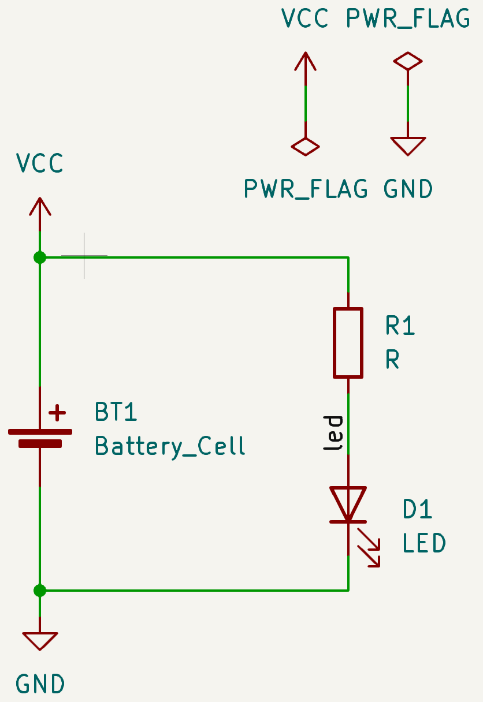
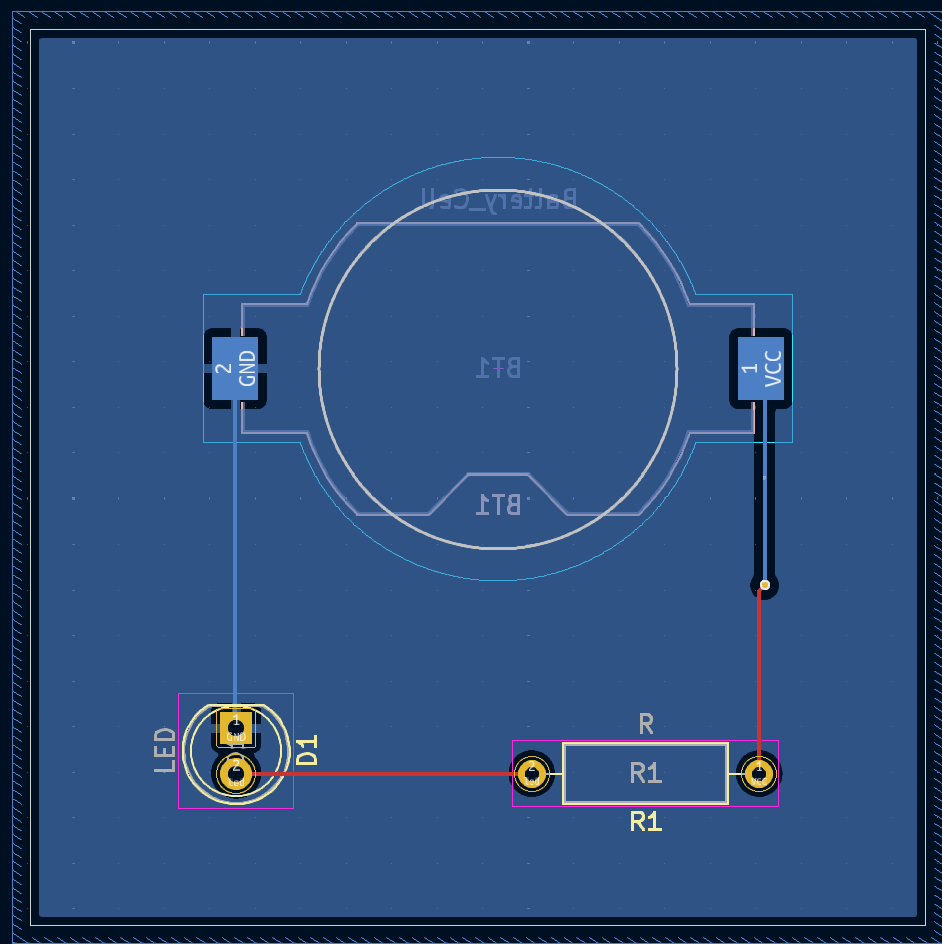
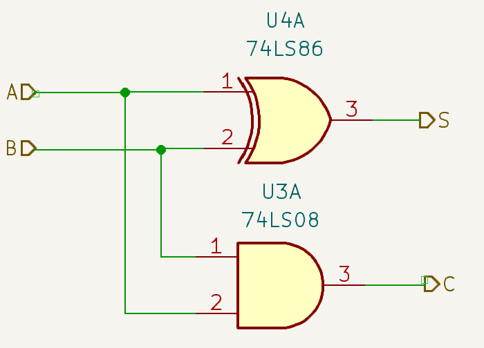
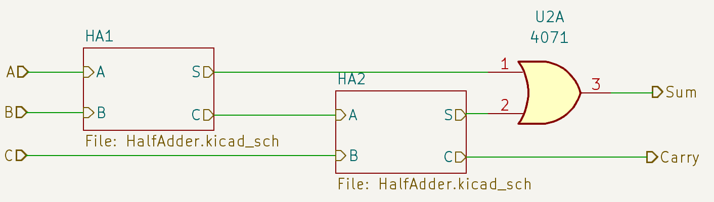
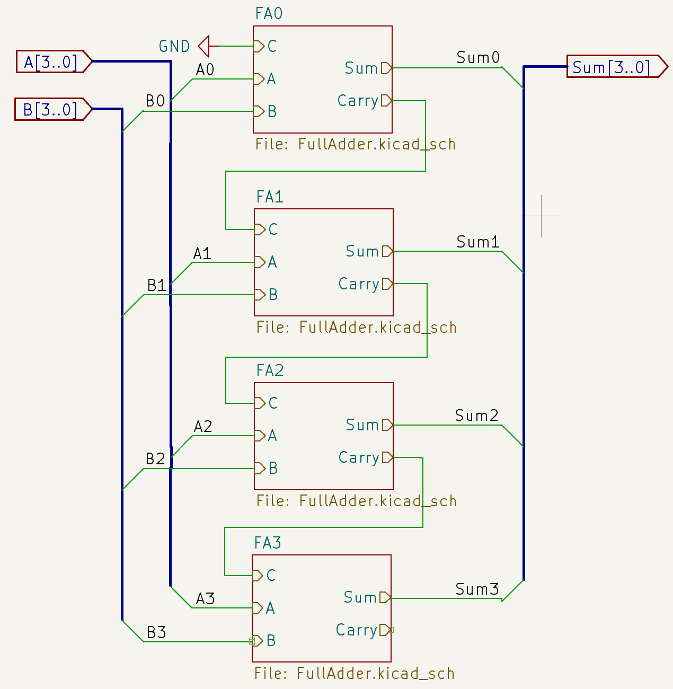
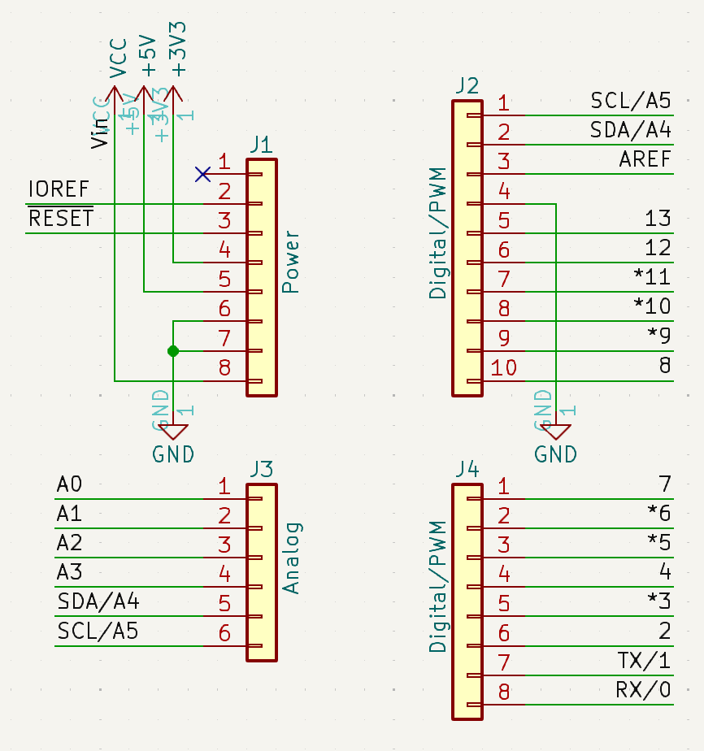
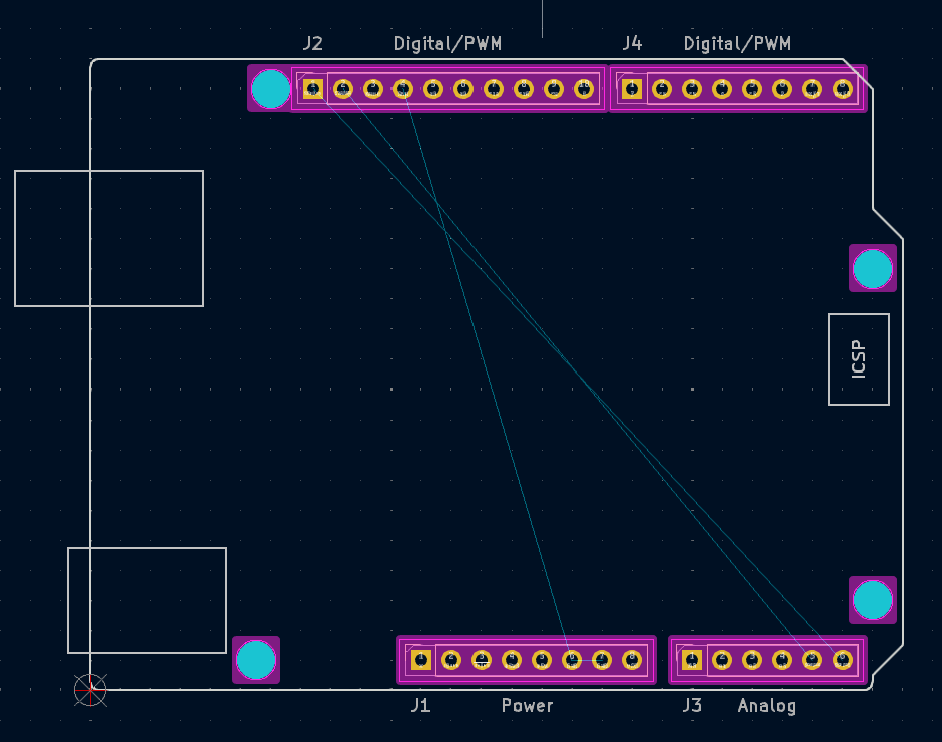

# KiCAD Tutorial
This tutorial introduces several examples to help second-year university students learn how to use KiCAD. For more detailed explanations, please refer to [this document](https://docs.google.com/document/d/1ExvIu8tnpRs45NydWLtySDykhyoZ8oFFZSsFo3mHvT8/edit?tab=t.0#heading=h.j3pbzu6m0ixx).

## PCB Examples
* [Simple LED](./Simple_LED/): A simple example from schematic to PCB
<table>
    <tr>
        <td></td>
        <td></td>
    </tr>
</table>
* [Wheatstone Bridge](./WheatstoneBridge/): An example of analog simulation 
<table>
    <tr>
        <td></td>
        <td></td>
    </tr>
</table>
* [4bits adder](./4bitsFullAdder/): An example of hierarchical schematic  
<table>
    <tr>
        <td></td>
        <td></td>
    </tr>
    </tr>
        <td></td>
    </tr>
</table>
## Symbol & Footprint Editor  
[Arduino_UNO](./images/Arduino_UNO_Symbol.png): Using Template  
<table>
    <tr>
        <td></td>
        <td></td>
    </tr>
</table>
* Texas EVM board Extension

## Importing External PCBs
* [Adafruit nRF52 Bluefruit feather](Adafruit_nRF52_Bluefruit) from [Eagle PCB](https://github.com/adafruit/Adafruit-nRF52-Bluefruit-Feather-PCB), [3D model](https://github.com/adafruit/Adafruit_CAD_Parts/tree/main/4062%20nRF52840%20Feather)  
<video width="320" height="240" controls autoplay>
    <source src="videos/circuitpython_4062-nRF52830-Feather.mp4" type="video/mp4">
    Your browser does not support the video tag.
</video>
