# KiCad 튜토리얼
대학교 2학년 학생이 KiCad 사용법을 익힐 수 있도록 만든 예제 모음이다. 자세한 설명은 [이 문서](https://docs.google.com/document/d/1ExvIu8tnpRs45NydWLtySDykhyoZ8oFFZSsFo3mHvT8/edit?tab=t.0#heading=h.j3pbzu6m0ixx)를 참고한다.

- 모든 예제는 **KiCad 10** 기준이다.
- 각 예제 폴더에 README가 있다. 번호 순서대로 따라가면 된다.
- KiCad 공식 설명서는 [Docs](./Docs/)에 있다. 처음이라면 *Getting Started in KiCad* 부터 읽는다.

| 폴더 | 내용 |
|---|---|
| [10_Simple_LED](./10_Simple_LED/) | 첫 예제. 회로도에서 PCB, 거버 출력까지 |
| [20_WheatstoneBridge](./20_WheatstoneBridge/) | 회로 시뮬레이션과 PCB를 하나의 회로도로 |
| [22_4bitsFullAdder](./22_4bitsFullAdder/) | 계층 회로도, 논리 IC 보드 |
| [30_Arduino](./30_Arduino/) | Arduino UNO 템플릿과 관련 보드 |
| [70_Simulation](./70_Simulation/) | SPICE 시뮬레이션 전용 예제 |
| [Applications](./Applications/) | 응용 예제(실험 키트, 외부 PCB 가져오기) |
| [Docs](./Docs/) | KiCad 공식 설명서 |

---

## 1. 기본 PCB 예제

### [예제 1. Simple LED](./10_Simple_LED/)
코인 전지로 LED를 켜는 가장 간단한 회로이다. 회로도 작성 → 풋프린트 지정 → PCB 배치·배선 → 거버 출력까지 KiCad의 전체 흐름을 익힌다.
<table>
    <tr>
        <td>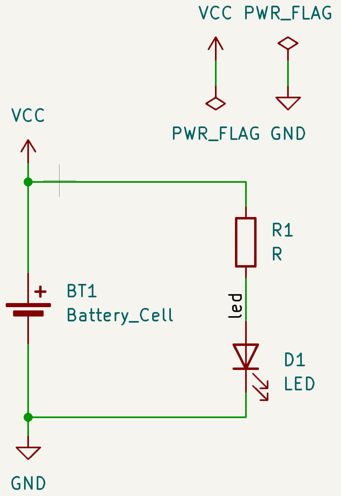</td>
        <td>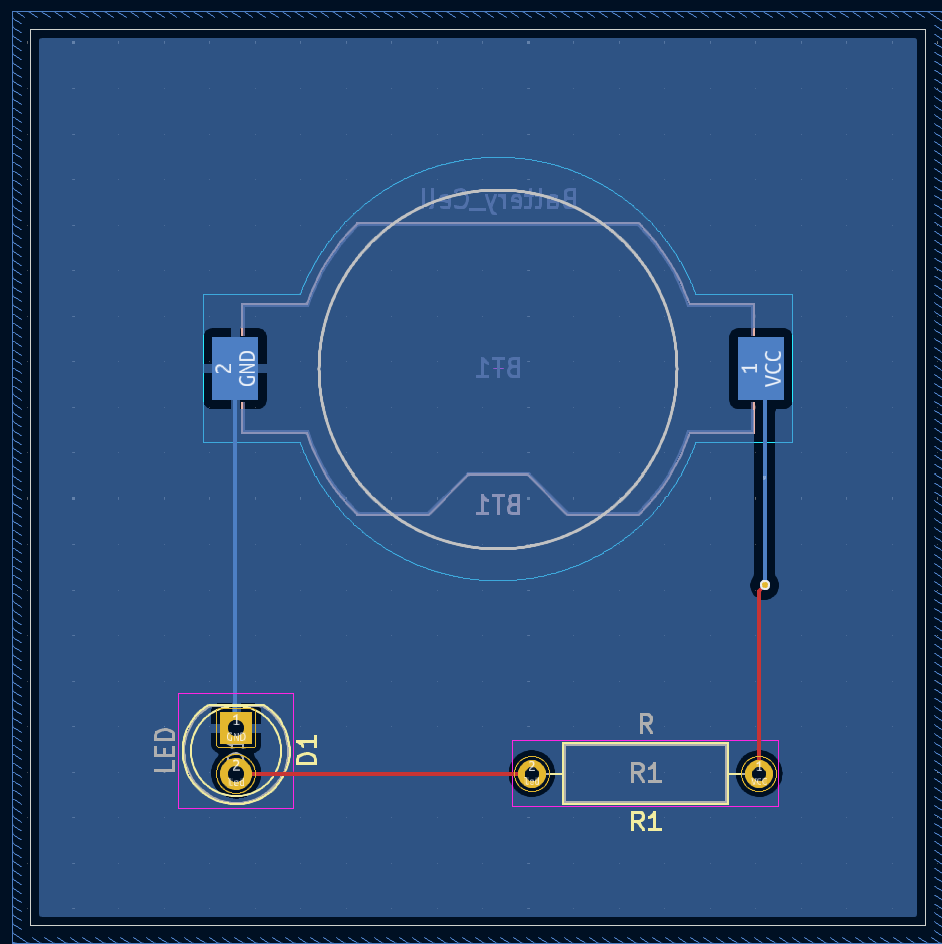</td>
    </tr>
</table>

### [예제 2. Wheatstone Bridge](./20_WheatstoneBridge/)
휘트스톤 브리지를 SPICE로 시뮬레이션하고 PCB로 만든다. 시뮬레이션 전용 부품과 PCB 전용 부품을 한 회로도에서 나누어 쓰는 방법(Exclude from simulation / board)을 익힌다.
<table>
    <tr>
        <td>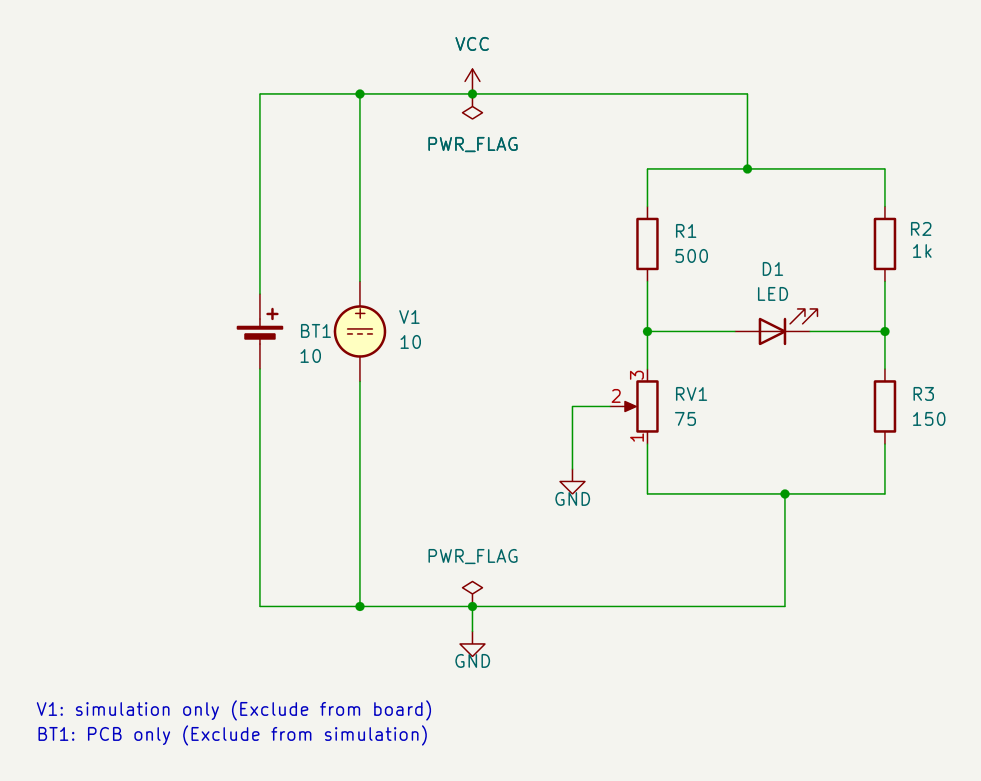</td>
        <td>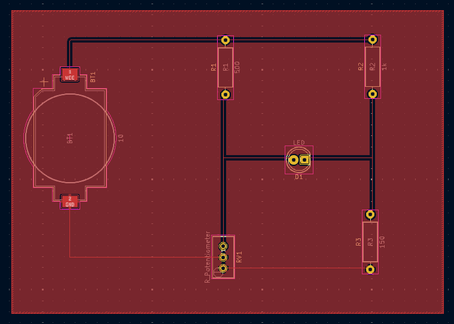</td>
    </tr>
</table>

### [예제 3. 4bits Full Adder](./22_4bitsFullAdder/)
반가산기 → 전가산기 → 4비트 덧셈기로 올라가며 **계층 회로도** 를 익힌다. 입력 스위치, 출력 LED, 전원까지 넣어 실제 보드로 만들고, 배선 실습용 PCB와 자동 배선 완성본을 함께 제공한다.
<table>
    <tr><td colspan="2">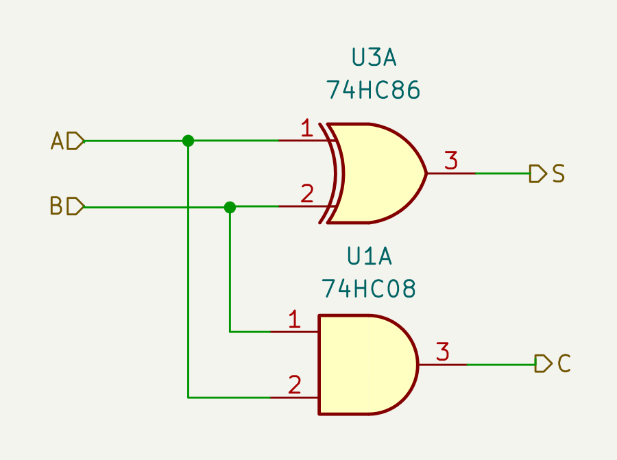</td></tr>
    <tr><td colspan="2">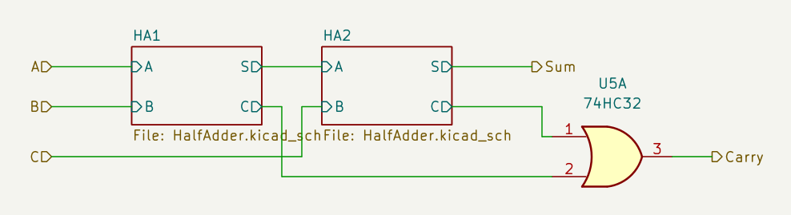</td></tr>
    <tr><td>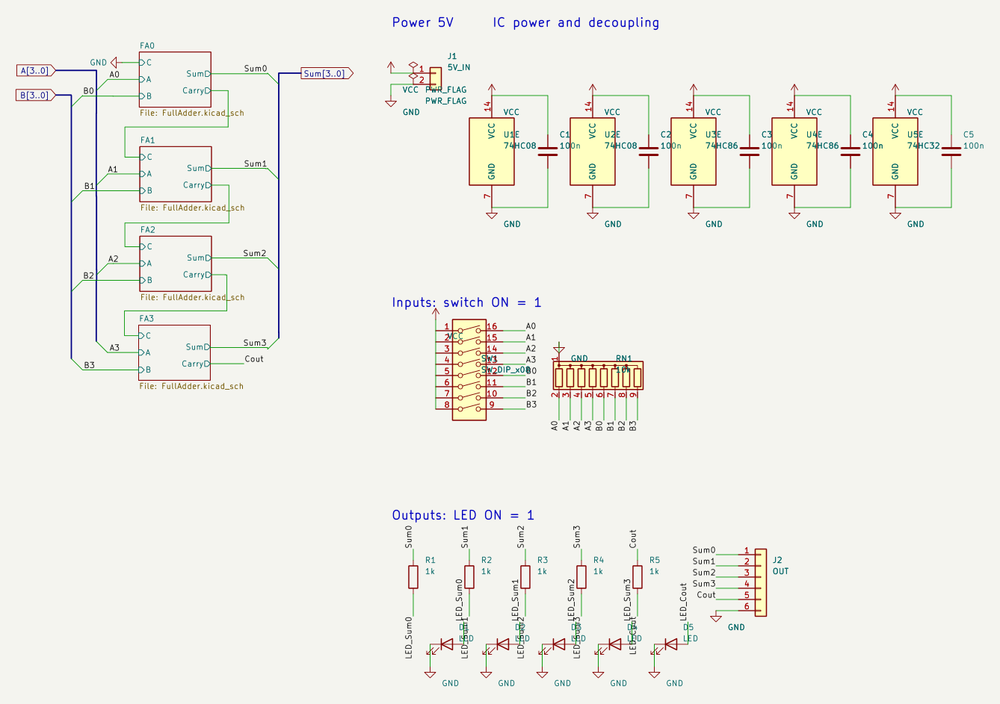</td><td>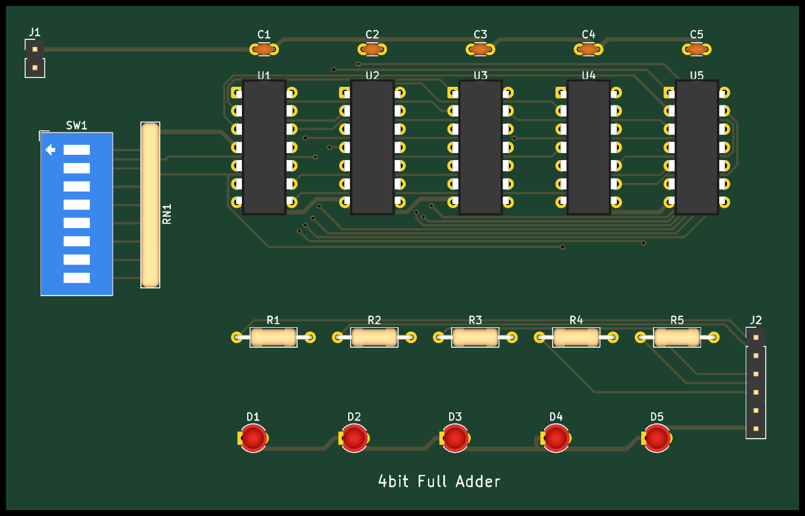</td></tr>
</table>

---

## 2. Arduino

### 심볼·풋프린트 편집기: [Arduino_UNO](./30_Arduino/Arduino_UNO/)
KiCad 템플릿으로 Arduino UNO 쉴드의 외곽과 헤더를 만든다.
<table>
    <tr>
        <td>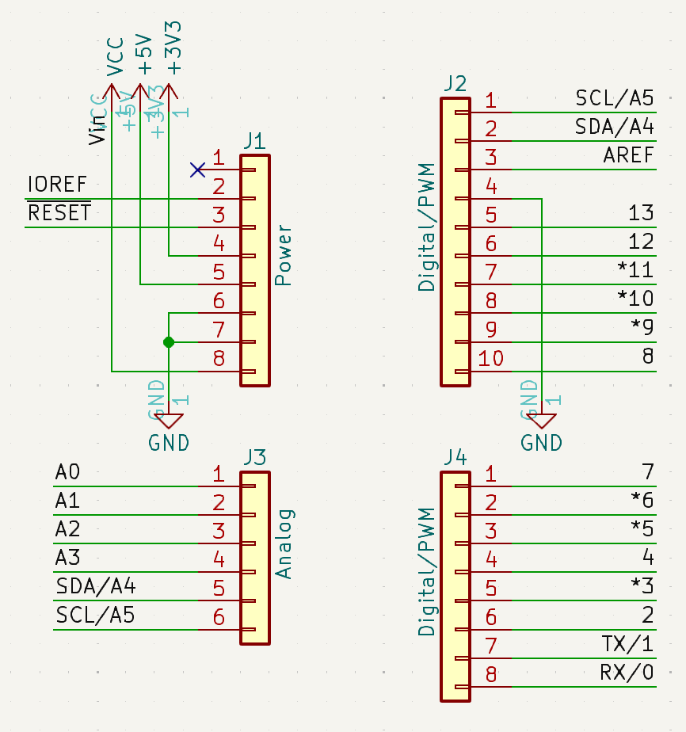</td>
        <td>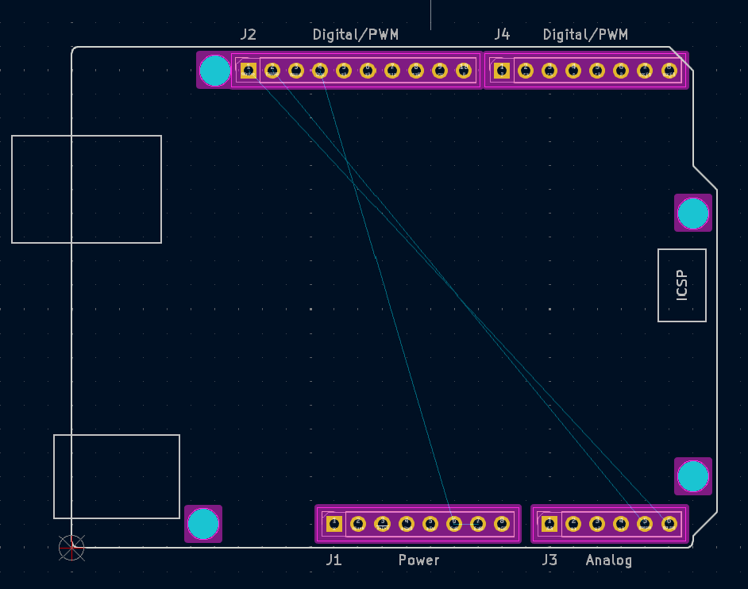</td>
    </tr>
</table>

### Arduino 관련 프로젝트
[30_Arduino](./30_Arduino/) 폴더에 모아 두었다.
* [Arduino UNO (ATmega328P)](./30_Arduino/UNO_ATmega328P/): Arduino_UNO 템플릿으로 만든 UNO 호환 보드(ATmega328P, 크리스털, 리셋, ICSP, PCB)
* [Arduino UNO I2C LCD](./30_Arduino/Arduino_UNO_I2C_LCD/): Arduino UNO에서 PCF8574 I2C 확장 칩으로 16×2 LCD를 구동하는 회로(회로도만)
* [nRF52840 UNO](./30_Arduino/nRF52840_UNO/): Adafruit Feather nRF52840 Express를 Arduino UNO 레이아웃에 맞춘 보드

---

## 3. 시뮬레이션
PCB 없이 회로도와 시뮬레이션만 다루는 예제를 [70_Simulation](./70_Simulation/)에 모아 두었다. 예제마다 README가 있다.
* [Transient Analysis](./70_Simulation/Transient_Analysis/): 펄스 전원으로 구동하는 RC 회로의 충전과 방전 (`.tran`)
* [Frequency Analysis](./70_Simulation/Frequency_Analysis/): RC 저역통과 필터와 CR 고역통과 필터 비교 (`.ac`)
* [AC Analysis](./70_Simulation/AC_Analysis/): 직렬 RLC 대역통과 필터 (`.ac`)
* [Transistor Bias](./70_Simulation/TransistorBias/): 제조사 2N3904 모델을 쓴 BJT 동작점 (`.op`)
* [Half Adder](./70_Simulation/HalfAdder/): [SpiceModels](./70_Simulation/SpiceModels/)의 74LS 모델을 쓴 디지털 시뮬레이션 (`.tran`)

---

## 4. 응용 예제

### [Analog Discovery 2와 UNO 또는 Adafruit nRF52 Bluefruit 연결](./Applications/Arduino_AD2Kit/)
<table>
    <tr>
        <td>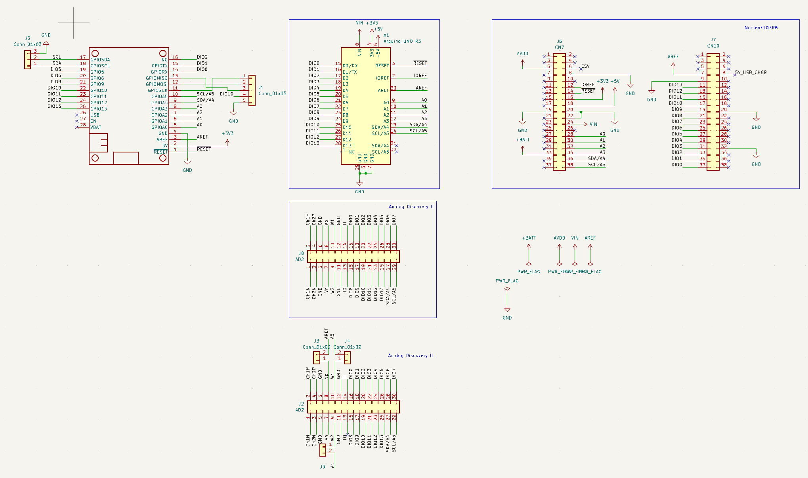</td>
        <td>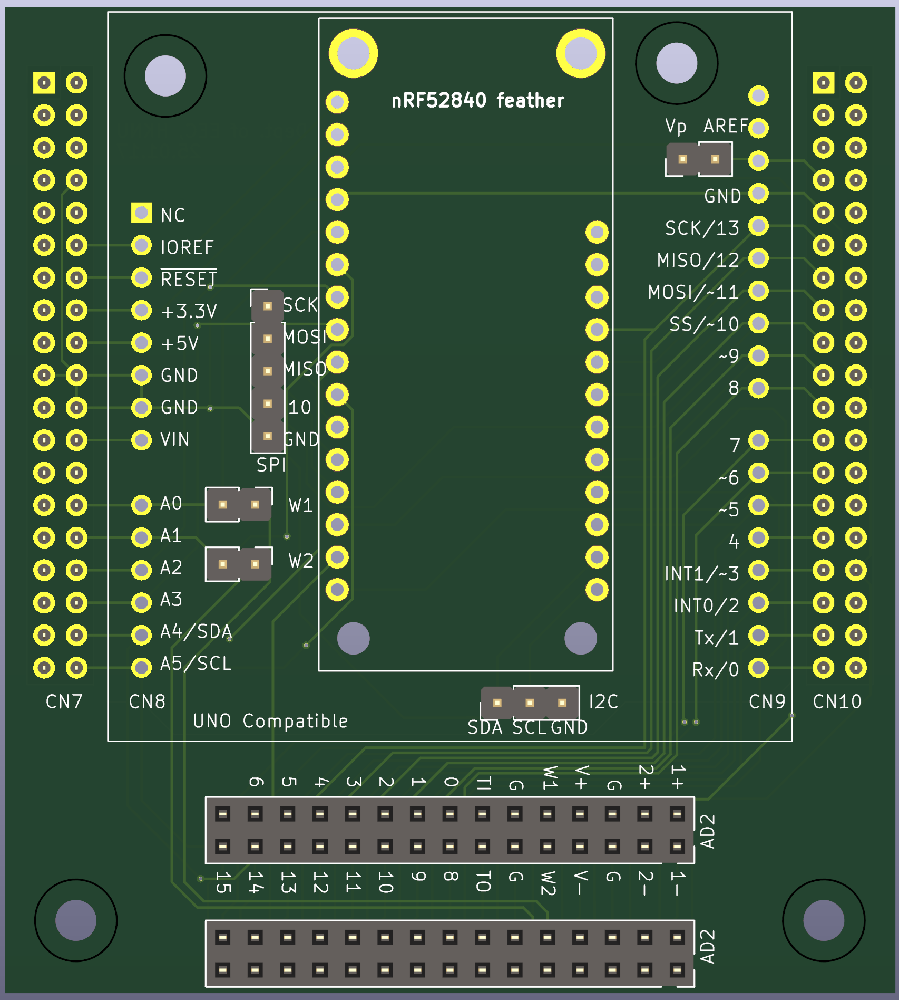</td>
    </tr>
</table>

### 외부 PCB 가져오기
* [Adafruit nRF52 Bluefruit Feather](./Applications/Adafruit_nRF52_Bluefruit/): [Eagle PCB](https://github.com/adafruit/Adafruit-nRF52-Bluefruit-Feather-PCB)와 [3D 모델](https://github.com/adafruit/Adafruit_CAD_Parts/tree/main/4062%20nRF52840%20Feather)을 KiCad로 가져온 예제

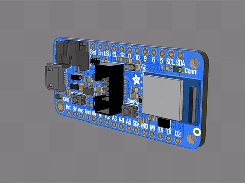

### Texas Instruments EVM 보드 확장
(준비 중)
